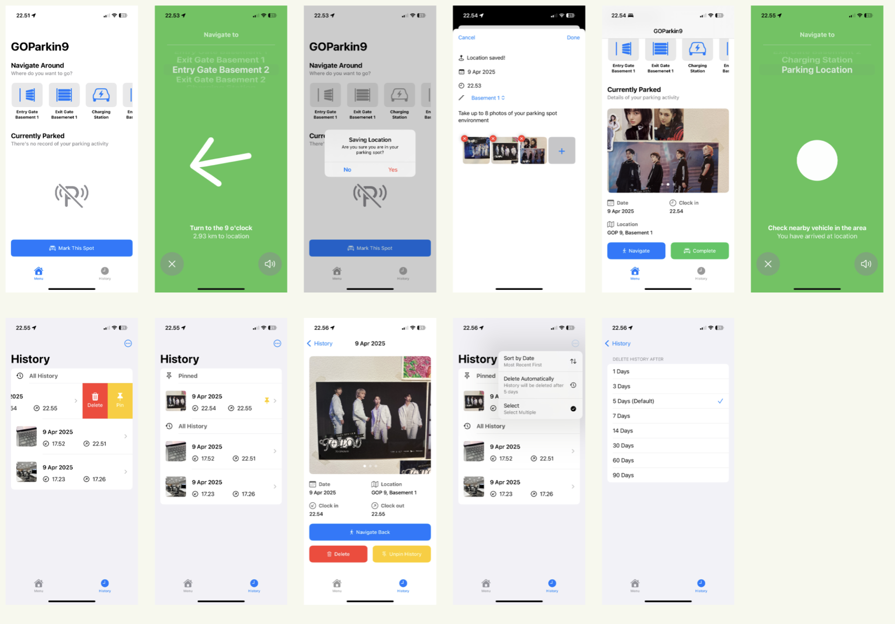

# GOParkin9

GOParkin9 is an iOS application developed as part of the C8S2 Core Challenge. The app is designed to help users easily remember where they parked their vehicle and navigate back to it with ease. Built using SwiftUI, GOParkin9 focuses on simplicity, accessibility, and reliability.

## 🌟 Key Features

- 🚗 **Add Parking Record**: Capture a photo of your parked vehicle and save its location.
- 🧭 **Smart Navigation**: Navigate back to your vehicle using CoreLocation.
- 🗣️ **Voice Guidance**: Get spoken directions using AVFoundation.
- 🧾 **Parking History**: View and manage previous parking records.
- ⚙️ **History Settings**: Customize how long your parking records are stored.

## 📸 App Screenshots


## 🧰 Tools & Technologies

- **Swift & SwiftUI** – Main language and UI framework.
- **CoreLocation** – Used for GPS and navigation features.
- **AVFoundation** – Enables voice guidance and speech accessibility.
- **SwiftData** – Handles local data persistence for parking records.

## 🚧 Setup Instructions

1. Clone the repository:
   ```bash
   git clone https://github.com/ricotandrio/C8S2-CoreChallenge-GOParkin9.git
   ```

2. Open the project in Xcode:
   ```bash
   open -a xcode C8S2-CoreChallenge-GOParkin9.xcodeproj
   ```

3. Build and run on an iOS device or simulator.

## 📃 License

Will be updated soon.
